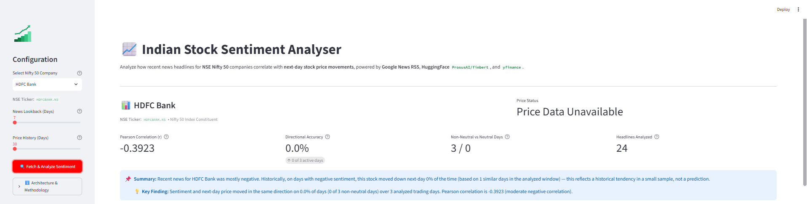
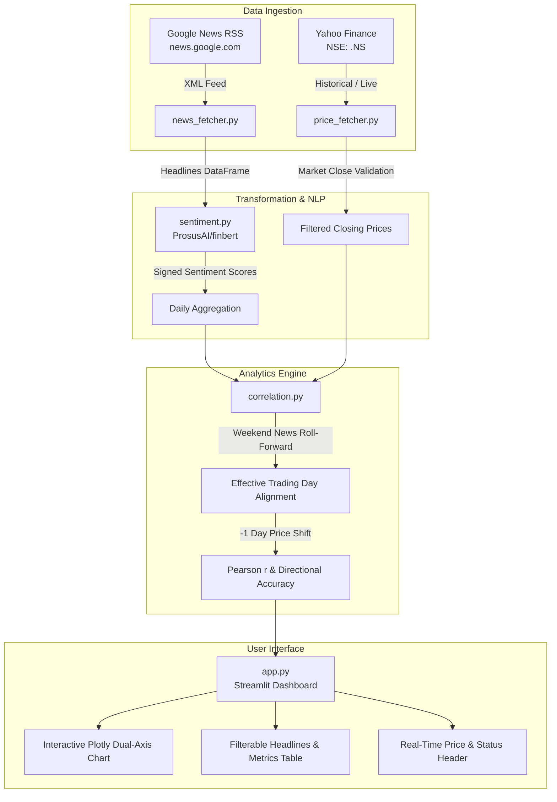

# 📈 Indian Stock Sentiment Analyser (NSE Nifty 50)

A financial NLP and time-series analytics application that investigates whether accumulated news headlines for **NSE Nifty 50** companies correlate with and predict **next-day stock price movements**.

The application combines structured **Google News RSS** ingestion, sentiment classification via HuggingFace's **`ProsusAI/finbert`** transformer model, historical daily price action from **`yfinance`**, and statistical correlation analysis with a $-1$ day price shift to evaluate directional accuracy.

---

## 📸 Application Preview




---

## 🏗️ Architecture Overview

The pipeline follows a modular, decoupled architecture where each layer can be tested and executed independently:



### Module Breakdown

| Module | Primary Responsibility | Key Functions / Classes |
|:---|:---|:---|
| [`news_fetcher.py`](news_fetcher.py) | Ingests and parses XML feeds from Google News RSS | `fetch_headlines(company_name, days)` |
| [`price_fetcher.py`](price_fetcher.py) | Fetches NSE prices, validates market hours, drops incomplete intraday data | `fetch_prices()`, `is_market_closed_for_date()`, `get_current_price_summary()` |
| [`sentiment.py`](sentiment.py) | Runs HuggingFace FinBERT pipeline and produces signed continuous scores | `score_sentiment()`, `aggregate_daily_sentiment()` |
| [`correlation.py`](correlation.py) | Rolls weekend news, shifts returns by -1 day, computes Pearson $r$ and directional match | `correlate_sentiment_and_returns()`, `roll_to_next_trading_day()` |
| [`app.py`](app.py) | Streamlit web application with caching, dual-axis Plotly charts, and all 50 Nifty constituents | `st.set_page_config`, `@st.cache_data`, `@st.cache_resource` |

---

## Design Decisions

Key architectural decisions and the reasoning behind them:

### 1. Google News RSS vs. Direct Web Scraping
* **Anti-Scraping Resistance:** Top Indian financial portals (*Moneycontrol*, *The Economic Times*, *Mint*, *Business Standard*) employ aggressive Cloudflare protections, dynamic JavaScript hydration, CAPTCHAs, and frequently changing DOM structures. Direct scraping is brittle and violates Terms of Service.
* **Structured XML Protocol:** Google News provides a standardized, reliable XML RSS feed (`news.google.com/rss/search`) parameterized for the Indian financial market (`hl=en-IN&gl=IN&ceid=IN:IN`). It guarantees clean metadata (title, publication timestamp, source publisher, and canonical URL) with low latency and zero headless browser overhead.

### 2. FinBERT vs. Generic Sentiment Models (VADER / Standard BERT)
* **Domain-Specific Vocabulary:** Standard NLP models fail on financial terminology. Words like `"risk"`, `"liability"`, `"hedging"`, `"drag"`, or `"plunge"` are interpreted as negative in colloquial English, whereas in financial statements and corporate news they are standard descriptive terms.
* **Trained on Financial Corpora:** `ProsusAI/finbert` was fine-tuned on the Financial PhraseBank dataset, enabling calibrated classification into positive, negative, and neutral categories.
* **Continuous Signed Metric:** We map FinBERT's discrete class probabilities into a continuous signed score:
  $$\text{Score} = \begin{cases} +\text{confidence}, & \text{if label is Positive} \\ -\text{confidence}, & \text{if label is Negative} \\ 0.0, & \text{if label is Neutral} \end{cases}$$

### 3. The -1 Day Return Shift (Eliminating Lookahead Bias)
* **Direction of Causality:** Markets react to news *after* it is published. Aligning day $t$ sentiment with day $t$ return creates simultaneous lookahead bias — an afternoon intraday price drop often triggers negative evening headlines, which falsely inflates same-day correlation.
* **Predictive Signal Testing:** Shifting price returns by $-1$ day aligns day $t$ accumulated sentiment with day $t+1$ close-to-close return:
  $$\text{Next-Day Return}_t = \frac{\text{Close}_{t+1} - \text{Close}_t}{\text{Close}_t} \times 100\%$$
  This tests whether sentiment has an actual **leading, predictive relationship** with market movement.

### 4. Directional Accuracy & Active Non-Neutral Day Counts
* **Pearson Correlation ($r$):** Measures linear co-movement across all days, including subtle fractional price shifts.
* **Directional Accuracy (%):** Measures how often the sign of sentiment matched the sign of the next day's price move:
  $$\text{Directional Match} = (\text{Mean Sentiment}_t \times \text{Next-Day Return}_t) > 0$$
* **Statistical Honesty:** A directional accuracy of 80% evaluated over only 3 active days is statistical noise. We explicitly filter out neutral days ($|\text{sentiment}| < 0.05$) and report the exact count of active days (e.g. *"4 of 6 active days"*) to prevent deceptive percentage inflation.

### 5. Intraday vs. Official Closing Prices
* **The Problem:** During market hours, `yfinance` returns the live Last Traded Price (LTP) in the `Close` column. Treating an unfinalized session as a completed close causes premature next-day return calculations against an incomplete day.
* **The Solution:** The `is_market_closed_for_date()` guard evaluates the exchange timezone (`Asia/Kolkata`):
  * Prior days ($\text{date} < \text{today}$) are marked **Closed**.
  * Today ($\text{date} == \text{today}$) is **In Progress** until 15:30 IST.
  * Incomplete intraday rows are excluded from return and correlation calculations. Yesterday's row displays `NaN` for Next-Day Return until today's session officially settles.
  * The top of the dashboard displays a prominent live price card distinguishing `Live Market (In Progress)` from `Official Close`.

---

## 🚀 How to Run Locally

### 1. Prerequisites
* **Python 3.10 - 3.13** installed on your system.
* Active Internet connection (to query Google News RSS, Yahoo Finance, and download the FinBERT weights on initial run).

### 2. Clone and Setup Environment
```bash
# Navigate to project root
cd "d:/Stock Analysis"

# Create a virtual environment
python -m venv venv

# Activate virtual environment
# On Windows (PowerShell):
.\venv\Scripts\Activate.ps1
# On Windows (Command Prompt):
.\venv\Scripts\activate.bat
# On Linux / macOS:
source venv/bin/activate
```

### 3. Install Dependencies
Install exact pinned dependencies:
```bash
pip install -r requirements.txt
```

### 4. Launch the Application
```bash
streamlit run app.py
```
Open your browser at `http://localhost:8501`.

### 5. Running Individual Component Tests
Each module includes a standalone `__main__` test block for debugging:
```bash
# Test price fetching and market close logic
python price_fetcher.py

# Test Google News headline fetching
python news_fetcher.py

# Test sentiment scoring with FinBERT
python sentiment.py

# Test correlation and return shifts
python correlation.py
```

---

## 📂 Project Structure

```
Stock Analysis/
├── app.py               # Streamlit web application & Plotly visualizations
├── backfill_bigquery.py # Batch backfill script to populate BigQuery with historical stock data
├── bigquery_ml.sql      # SQL script for BigQuery ML data transformation, modeling, and evaluation
├── correlation.py       # Alignment, -1 day shift, Pearson r, and directional accuracy
├── news_fetcher.py      # Google News RSS ingestion and parsing
├── price_fetcher.py     # yfinance historical prices, market-close validation, price summary
├── sentiment.py         # HuggingFace ProsusAI/finbert sentiment scoring pipeline
├── requirements.txt     # Exact pinned dependencies from virtual environment
└── README.md            # Architecture documentation and interview reference
```

---

## ⚠️ Limitations & Analytical Caveats

1. **Sample Size Limitations:**
   Within a standard 30 to 60-day window, individual companies rarely have more than 5 to 15 days with active non-neutral news. Drawing definitive quantitative conclusions from small samples risks overfitting to random market noise.
2. **Single-Headline Days:**
   Days with a single isolated headline provide a weak, noisy signal compared to high-volume news days (e.g. earnings announcements, board meetings, or regulatory audits) where dozens of articles corroborate sentiment.
3. **Correlation Does Not Imply Causation:**
   Stock prices are driven by broader macroeconomic trends, RBI monetary policy decisions, FII/DII institutional liquidity flows, crude oil price fluctuations, and currency movements that news headlines alone cannot capture.
4. **Domain and Language Specificity:**
   `ProsusAI/finbert` was trained primarily on global financial English (SEC filings, international financial journals). It may occasionally miss Indian corporate idioms, regional business vernacular, or domestic regulatory shorthand (e.g., *NCLT*, *SEBI order*, *promoter pledge*).
5. **Exploratory Baseline, Not an Execution Strategy:**
   This tool is intended as an exploratory analytical baseline for feature engineering and hypothesis testing. It does not account for transaction slippage, bid-ask spreads, STT (Securities Transaction Tax), brokerage costs, or liquidity constraints.

---

## 🔮 BigQuery ML Extension (optional)

### Setup
1. **Create BigQuery Dataset:** In Google Cloud Console, create a dataset named `stock_data`.
2. **Service Account:** Create a GCP service account with BigQuery Data Editor and Job User permissions, download the JSON key, and set the environment variable:
   ```bash
   export GOOGLE_APPLICATION_CREDENTIALS="/path/to/service-account.json"
   # On Windows (PowerShell):
   $env:GOOGLE_APPLICATION_CREDENTIALS="C:\path\to\service-account.json"
   ```
3. **Backfill Historical Data:** Run the backfill script:
   ```bash
   python backfill_bigquery.py
   ```
4. **Run SQL in BigQuery Console:** Execute the statements in [`bigquery_ml.sql`](bigquery_ml.sql) directly in the BigQuery console.

> **Note:** The Streamlit dashboard (`app.py`) works entirely independently without any of this BigQuery setup or execution.

### Results
* **Dataset Scope:** 49 large-cap NSE stocks (46 of them are in the dashboard's Nifty 50 list; the backfill script uses its own ticker list), yielding 665 labelled stock-days.
* **Logistic Regression:** Achieved an **ROC AUC of 0.51** and an accuracy of **55.6%** (using the default BigQuery ML data split). Note that a baseline always predicting "down" scores approximately 58% on this dataset.
* **Boosted Tree Classifier:** An earlier boosted-tree run on a smaller table scored an **ROC AUC of 0.48** and was not re-run on the full table.
* **Conclusion:** Near-chance, a small-sample negative result — no reliable signal was found in this small sample.
